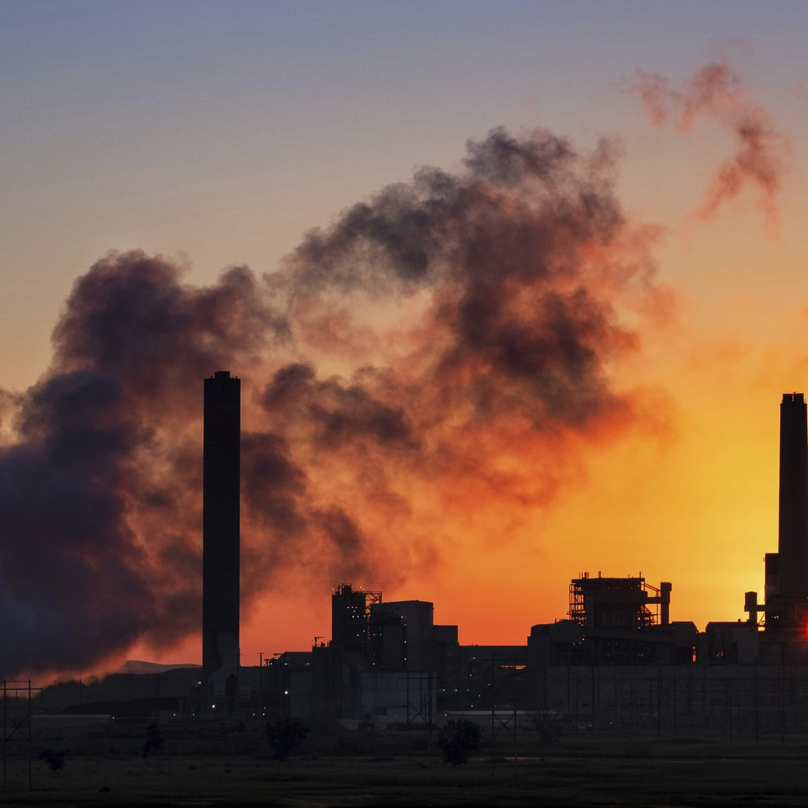

# Assessment of Air Quality in an Urban Area of Belgrade, Serbia

Clean air is considered to be a basic requirement for human health and well being. Various
chemicals are emitted into the air from both, natural and anthropogenic sources. In spite of the
introduction of cleaner technologies in industry, energy production and transport, air pollution
remains a major health risk and tighter emission controls are being enforced by many
governments. In humans, the pulmonary deposition and adsorption of inhaled chemicals from
the air can have direct consequences on health. Public health can also be indirectly affected by
deposition of air pollutants in environmental media and uptake by plants and animals,
resulting in chemicals entering the food chain or being present in drinking water, and thereby
constituting additional sources of human exposure. Furthermore, the direct effects of air
pollutants on plants, animals and soil can influence the structure and function of ecosystems,
including their self-regulation abilities, thereby and thus affecting the quality of life.
According to the most recent update of the WHO (World Health Organization) air quality
guidelines, many studies were published that had investigated the effects of air pollution on
human health. Particulate matter pollution is nowadays one of the problems of the most
concern in great cities, not only because of the adverse health effects, but also for the
reducing atmospheric visibility and affect to the state of conservation of various cultural
heritages (Van Grieken & Delalieux, 2004). On a global scale, particulate matter (PM) also
influences directly and/or indirectly the Earth’s radiation energy balance, and can
subsequently impact on global climate change (IPCC, 2001).
The measurement of the levels of atmospheric particulate matter is a key parameter in air
quality monitoring throughout the world regarding the cause/effect relationship between
exposure PM levels and health impacts (WHO, 2002; WHO, 2003). A number of
epidemiological studies (Dockery & Pope, 1994, 2006; Schwartz et al., 1996, 2001) have
demonstrated that acute and chronic health effects are related to the inhalable PM10
(aerodynamic diameter less than 10 μm) exposure in the urban environment, and some data
also seem to indicate possible seasonal effects of the particulate matter on human health.
This is especially important for urban aerosols, whose variety of size and composition make
complete characterization a difficult task. 
As a result of health and environmental impacts of PM, more rigorous regulations are in
force in the USA and European countries. PM standards, issued by European Commission
(EC), have included PM10 monitoring and limit values in the Air Quality Directive in 1999
(EC, 1999). Directive established in the first stage, annual limit value of 40 μg m-3 and 24 h
limit value of 50 μg m-3 (not to be exceeded more than 35 times in a calendar year) to be met
by 2005, and in the second stage annual limit value of 20 μg m-3 and 24h limit value of 50 μg
m-3 ( not to be exceded more than 7 times a calendar year) to be met by 2010.
Although the current focus on health-related sampling of particulate matter is on PM10,
recent research pointed out more serious health effect of fine particles, PM2.5 (aerodynamic
diameter less than 2.5 μm), and even PM1.0 (aerodynamic diameter less than 1.0 μm) (Vallius
et al., 2005; Ariola et al., 2006) and signed that the health effects associated with PM are
related mostly to anthropogenic emission sources. EC has also established average PM2.5
annual limit of 20 μg m-3 (EN 14907, 2005) and current WHO Air Quality Guidelines set 10
μg m-3 as annual average and 25 μg m-3 as 24 h average (WHO, 2006).
Within the European Program for Monitoring and Evaluation of the Long-Range
Transmission of Air Pollutants (EMEP), measurements of PM10 and trace metals, as highly
toxic species, have been introduced. Spatial and temporal variation of atmospheric aerosol
particles also gained in significance and resulted in an increased interest in the use of
analytical techniques capable of measuring the size, morphology, and chemical composition
of individual aerosol particles. Such data are essential for an understanding of particle
formation, transport, transformation and deposition mechanisms, as well as, the impact of
particles inhaled by a respiratory system.
The studies of the transport and mobilization of trace metals up to now have attracted
attention of many researchers (Nriagy & Pacyna, 1988; Pacyna et al., 1989; Alcamo et al.,
1992). Trace metals are persistent and widely dispersed in the environment and interacting
with different natural components results in toxic effects on the biosphere.
Trace elements are released into the atmosphere by human activities, such as combustion of
fossil fuels and wood, high temperature industrial activities and waste incinerations. The
combustion of fossil fuels constitutes the principal anthropogenic source for Be, V, Co, Ni,
Se, Mo, Sn, Sb, and Hg. It also contributes to anthropogenic release of Cr, Mn, Cu, Zn, and
As. High percentages of Ni, Cu, Zn, As, and Cd are emitted from industrial metallurgical
processes. Exhaust emissions from gasoline may contain variable quantities of Ni, Cu, Zn,
Cd, and Pb (Samara et al., 2003). Several trace metals are emitted through the abrasion of
tires (Cu, Zn, Cd) and brake pads (Sb, Cu), corrosion (V, Fe, Ni, Cu, Zn, Cd) lubricating oils
(V, Cu, Zn, Mo, Cd) or fuel additives (V, Zn, Cd, Pb) (Pacyna & Pacyna, 2001; Ward, 1990;
Sutherlan & Tolosa, 2000). The platinum group of elements, Rh, Pd and Pt, represent a
relatively new category of traffic related trace metals in the environment, specially urban
one, due to their application in automobile catalytic converters since the beginning of the
1980s (Haus et al., 2007).
Most of the trace metals are emitted in particulate form (Molodovan et al., 2002) and are
present in almost all aerosol size fractions, but mainly accumulated in the smaller particles
(Espinosa et al., 2001). This has a great effect on the toxicity of metals since the degree of
respiratory penetration depends on particle size (Dockery and Pope, 1994, 2006; Espinosa et
al., 2001). Urban anthropogenic particles are mainly in the PM2.5 range and their sampling
diminishes the interference of natural sources and reduces the loss of potentially volatile
components such as ammonia and chloride. They could remain in the air with relatively long residence time and could efficiently penetrate human lungs, and cause greater response in epithelial cells of human respiratory tract (Li et al., 2002, 2003). In addition to
the PM mass limit values, also based on health impact criteria, recent European Union (EU)
standards set target (Ni, As, Cd) and limit (Pb) values for metals and polycyclic aromatic
hydrocarbons (PAHs) (EC, 1999; Directive 2004/107). Environmental technologies may have
to be adopted in specific industrial spots to reach the target values. For aimed reduction of
PM10 or PM2.5 levels detailed knowledge of sources and their respective contribution to the
PM levels, is required. 

